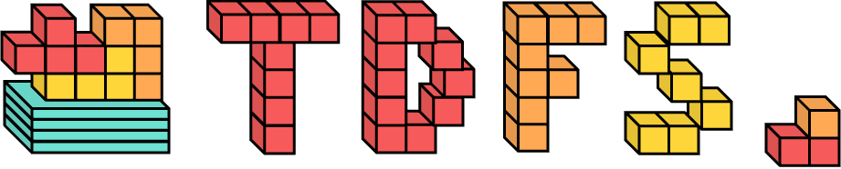
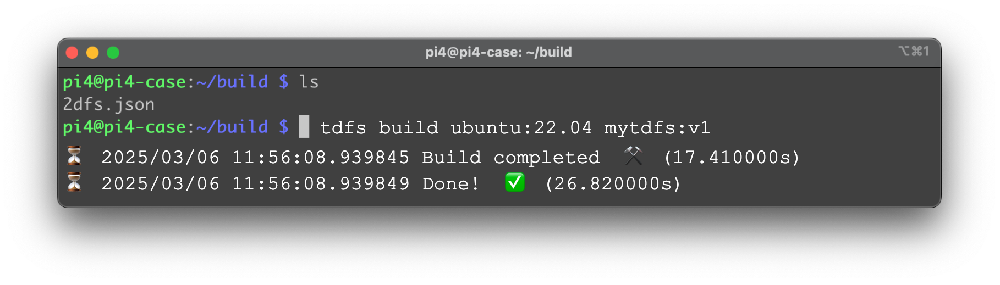

[](https://github.com/2DFS/2dfs-builder/actions/workflows/build-tdfs.yml)



# `tdfs`: a builder 👷‍♀️ for 2DFS images 

This is the command line interface that allows you to build and manage 2DFS images.

## Build and Install `tdfs` cli

Install the binary inside `~/bin/tdfs` (MacOS) or `~/.local/bin/tdfs` (Linux) using:

```
./install.sh
```

## Get Started

Navigate to the `examples/simple-2dfs` example directory.

Use `tdfs build ubuntu:22.04 mytdfs:v1` to create your first tdfs image.



## `tdfs --help`

```
Requires a 2dfs.yaml file in the current directory or a path to a 2dfs.yaml file. Read docs at https://github.com/2DFS/2dfs-builder

Usage:
  tdfs [command]

Available Commands:
  build       Build a 2dfs field from an oci image link
  help        Help about any command
  image       Commands to manage images
  version     Print the version number of tdfs

Flags:
  -h, --help   help for tdfs
```
## `tdfs` image push

You can push your tdfs image to an OCI+2DFS compliant registry using the `push` command. 

```
Usage:
  tdfs image push [reference] [flags]
```

You can deploy your own OCI+2DFS compliant registry, check out the [2DFS registry repository](https://github.com/2DFS/2dfs-registry) for more information.

## `tdfs` image export 


```
Usage:
  tdfs image export [reference] [targetFile] [flags]

Flags:
      --as string   export format, supported formats: tar
  -h, --help        help for export
```

You can use this to export a tdfs image a oci image using semantic labeling. 

E.g., 

```
tdfs image export mytdfs:v1--0.0.1.1 image1.tar.gz
```
This will export allotments (0,0),(0,1),(1,0),(1,1) as OCI layers. 

```
tdfs image export mytdfs:v1--0.0.0.0 image0.tar.gz
```
This will export only allotment (0,0) as OCI layer. 

## Run `tdfs` images in docker without a registry

If you exported a partitioned image as tar.gz file, like e.g., `image1.tar.gz`.
You can import it as a docker image using the docker load command:

```
docker load -i image1.tar.gz
```
The output should look like this
```
docker load -i image1.tar.gz                                                           125 ↵
Loaded image ID: sha256:0ce9917ccee3aafde0de242f0261120108b54660e26e0956d5c15f5391c25259
Loaded image ID: sha256:9e4c7ff570e356f784b918bab8c06ec730eb71e471e822d74bb73f4a3687f0b7
Loaded image ID: sha256:d1af7cb720fabcfefd7ec6cb282060b2a6f152c21da4a3bac50a5a86a0f07a06
Loaded image ID: sha256:6808b090f05171d053f93611e5061642b86a3a78717de2fcb4d73479a74f0085
Loaded image ID: sha256:5287804c49232c73a570b4bc3e1cdcad306400db4f36ecea7673dabb1383c5f8
```
This command created 5 images, one for each of the supported platform fo the ubuntu:22.04 base image. 

Then try and run this image as usual using the ID corresponding to your platform ID, e.g., 

```
docker run -it e254bc73d3bcd64864c5fad36aec4b487737ad406ac1175037552c01e570020b /bin/bash 
```

## Semantic label syntax 

Given the following 3x3 field
```
   0  1  2
    __ __ __
0  |__|__|__|
1  |__|__|__|
2  |__|__|__|

```

The semantic label `image:latest--x1.y1.x2.y2` will generate a partition such that:

**allotment (a) in Field (F) iff := a.row>=x1 & a.row <= x2 & a.col>=y1 & a.col<=y2** 

Smentic labels can be chained, e.g., `image:latest--x1.y1.x2.y2--x11.y11.x22.y22--...`
and the result will be the union of all partitions. 

## Platform selector

When exporting your image you can select a custom target platform for the partitioned image using the `--platform <os/arc>` flag. 

E.g., 
```
tdfs image export mytdfs:v1--0.0.0.0 imageamd64.tar.gz --platform linux/amd64
```

**N.b. If no platform is specified, the image exported image always includes all the available platforms of the base image**

